# 📡 Sistema de Gestión de Red ISP – Administración de Redes de Nueva Generación


> **Sistema de gestión centralizada para ISPs / WISPs** con integración MikroTik RouterOS API, facturación electrónica ecuatoriana (SRI) y monitoreo en tiempo real.

---

## 🗺️ Arquitectura del Sistema

El sistema está diseñado para interactuar de forma segura y eficiente con múltiples MikroTik RouterOS remotos o locales. Aunque el diseño por defecto y recomendado en producción sugiere el uso de túneles VPN ZeroTier (para evadir CGNAT y simplificar el ruteo), el backend se comunica mediante peticiones API sobre sockets TCP convencionales. Esto significa que **se soporta cualquier tipo de conectividad de red** (como IPs locales LAN, direcciones WAN públicas, Tailscale, WireGuard u otros túneles VPN) con solo registrar la dirección IP o host correspondiente.

A continuación se detallan los diagramas de arquitectura utilizando el flujo de referencia con ZeroTier:

### 1. Vista General de la Arquitectura



### 2. Flujo de Comunicación de Red



### 3. Lógica Interna del Backend



---

## 🌐 Acceso remoto vía ZeroTier

La plataforma completa (API, frontend, Adminer) puede quedar accesible desde cualquier lugar sin exponer puertos a Internet, uniendo el servidor a una red [ZeroTier](https://www.zerotier.com/) privada.

### Administración de nodos desde la app (routers MikroTik y otros equipos)

En **Ajustes → Generales → Integraciones → ZeroTier** puedes:

1. Crear una red en [my.zerotier.com](https://my.zerotier.com) y generar un API Token de ZeroTier Central.
2. Pegar el **Network ID** y el **API Token** en la app (se cifran con la misma clave `FERNET_KEY` que las contraseñas de los routers).
3. Ver el estado de la red y **autorizar/revocar** los nodos que se unan (routers MikroTik, laptops de técnicos, el propio servidor, etc.) sin salir del panel.
4. Al agregar o editar un Gateway MikroTik, vincularlo a un nodo ZeroTier autorizado autocompleta su IP con la dirección asignada por ZeroTier.

### Acceso remoto al servidor completo (opcional)

Para que el propio servidor (no solo los routers) sea alcanzable desde cualquier lugar:

```bash
# Solo en hosts Linux — network_mode: host no se comporta igual en
# Docker Desktop para Mac/Windows.
docker compose --profile zerotier up -d zerotier
docker compose exec zerotier zerotier-cli join <NETWORK_ID>
```

Luego autoriza el nuevo nodo desde **Ajustes → Integraciones → ZeroTier** en la app (aparecerá como pendiente). Como el contenedor usa `network_mode: host`, cualquier puerto que Docker ya publica (`5173`, `8000`, etc.) queda accesible también desde la IP ZeroTier del servidor, sin tocar el resto del stack.

---

## 🛠️ Stack Tecnológico

El proyecto está estructurado como un monorepo para facilitar la gestión conjunta de todos los servicios.

### Backend (API & Workers)

- **Lenguaje:** Python 3.12+
- **Framework:** FastAPI (REST + WebSockets)
- **Base de Datos:** PostgreSQL 16 (con particionado mensual para muestras de tráfico)
- **Caché y Mensajería:** Redis 7 (broker de Celery y almacén de sesiones activas)
- **Tareas Asíncronas:** Celery & Celery Beat (health check periódico, recolección de tráfico, suspensiones automáticas)
- **Conectividad MikroTik:** `librouteros` (Pool de conexiones persistentes con reconexión automática)
- **ORM & Migraciones:** SQLAlchemy 2.0+ con cargador de migraciones nativo personalizado y scripts SQL
- **Seguridad:** Cifrado Fernet para credenciales de routers y hashes de contraseñas de usuarios con bcrypt directo.

### Frontend (Panel Administrativo Web)

- **Framework:** React 18+ (Vite 5+ & TypeScript 5+)
- **Estilos:** Tailwind CSS 3.4+ & Componentes interactivos de **shadcn/ui**
- **Manejo de Estado:** Zustand (estado global) & TanStack Query v5 (caché e interactividad con el servidor)
- **Gráficos:** Recharts (tráfico en tiempo real y consumo de datos)
- **Mapas:** Leaflet (georreferenciación de clientes)
- **Formularios:** React Hook Form + validaciones estructuradas con Zod

---

## 📁 Estructura del Proyecto

```text
ispsetup/
├── backend/                  # Código fuente del backend (FastAPI)
│   ├── app/
│   │   ├── api/              # Routers FastAPI por módulo (auth, gateways_api, zerotier_api, clients...)
│   │   ├── models/           # Modelos de base de datos SQLAlchemy (user, gateway, system_settings...)
│   │   ├── schemas/          # Esquemas de validación Pydantic (user, gateway, zerotier...)
│   │   ├── services/         # Lógica de negocio (MikroTik, SRI, zerotier, etc.)
│   │   │   └── zerotier/     # Cliente de API de ZeroTier Central
│   │   ├── core/             # Configuración del sistema, auth, base de datos y seguridad
│   │   └── workers/          # Tareas asíncronas de Celery
│   ├── tests/                # Pruebas unitarias e integración (Pytest, incluye test_zerotier.py)
│   ├── migrations/           # Scripts de migración SQL crudos
│   └── requirements.txt      # Dependencias del backend
├── frontend/                 # Panel web de administración (React)
│   ├── src/
│   │   ├── components/       # Componentes visuales comunes (AppLayout, GatewayFormDialog...)
│   │   ├── pages/            # Vistas por módulo (DashboardPage, GatewaysPage, settings/ZeroTierSettingsSection.tsx...)
│   │   ├── stores/           # Almacenes de estado global (Zustand)
│   │   └── services/         # Clientes de consumo de API (incluye zerotier.ts)
├── architecture/             # Recursos visuales y diagramas SVG
├── nginx/                    # Archivos de configuración para proxy inverso
└── docker-compose.yml        # Orquestación de infraestructura en desarrollo (con soporte para --profile zerotier)
```

---

## 🚀 Inicio Rápido con Docker Compose

El proyecto incluye un entorno Docker optimizado que arranca todas las dependencias requeridas (Base de datos, Caché, API y Worker).

1. **Configurar el entorno:**
   Copia el archivo `.env.example` de la raíz a `.env` y define las variables de entorno principales (como las llaves de encriptación y base de datos):

   ```bash
   cp .env.example .env
   ```

2. **Levantar la infraestructura completa:**
   ```bash
   docker compose up --build
   ```

Este comando iniciará:

- **API Backend** en [http://localhost:8000](http://localhost:8000)
- **Frontend Web** en [http://localhost:5173](http://localhost:5173)
- **Adminer (Gestor DB)** en [http://localhost:8080](http://localhost:8080)
- **Redis y PostgreSQL** como bases de datos
- **Celery Worker & Beat** ejecutando tareas en segundo plano

---

## 💻 Desarrollo Local (Sin Docker)

Si prefieres ejecutar el código directamente en tu host local para un ciclo de desarrollo más ágil:

### Configuración del Backend

1. **Crear e iniciar el entorno virtual:**

   ```bash
   cd backend
   python3 -m venv .venv
   source .venv/bin/activate
   ```

2. **Instalar dependencias:**

   ```bash
   pip install -r requirements.txt
   ```

3. **Ejecutar el servidor Uvicorn en desarrollo:**
   ```bash
   uvicorn app.main:lifespan_app --reload --port 8000
   ```
   _(Nota: Asegúrate de tener instancias de PostgreSQL y Redis corriendo localmente y configuradas en el archivo `.env` del backend)._

### Configuración del Frontend

1. **Navegar e instalar paquetes de Node:**

   ```bash
   cd frontend
   npm install
   ```

2. **Ejecutar en modo dev:**
   ```bash
   npm run dev
   ```

---

## 🧪 Pruebas Unitarias y de Integración

El backend cuenta con una completa suite de pruebas unitarias que validan la autenticación, flujos de sesión, endpoints de configuración e integración con ZeroTier (utilizando mocks de su API).

Para correr las pruebas localmente usando una base de datos en memoria SQLite y mockeando Redis:

1. Instala las dependencias de testing:

   ```bash
   cd backend
   pip install -r requirements-test.txt
   ```

2. Corre la suite de pruebas mediante Pytest:
   ```bash
   DATABASE_URL="sqlite:///:memory:" REDIS_URL="redis://localhost:6379/0" SECRET_KEY="testkey123456789testkey123456789xx" FERNET_KEY="wlphuDlhKvtsvUg8lnnjWzNKJSP1dDzCZuYMFdhLcJg=" ENVIRONMENT=development python3 -m pytest tests/
   ```

---

## 🔒 Seguridad y Configuración Clave

- **Cifrado Fernet:** Las contraseñas de las APIs de MikroTik y los API Tokens de la integración de ZeroTier se almacenan cifrados en la base de datos PostgreSQL utilizando una clave AES Fernet única declarada en la variable `FERNET_KEY`. Nunca compartas ni pierdas esta variable en entornos de producción.
- **Seed de Administrador:** En el primer arranque, la aplicación autogenerará un usuario administrador inicial utilizando las credenciales provistas en el archivo `.env` (`ADMIN_SEED_EMAIL`, `ADMIN_SEED_PASSWORD`).
- **Endpoints de Auto-Configuración:** El sistema expone el endpoint `POST /api/auth/setup` para inicializar el administrador principal en instalaciones nuevas donde no exista ningún usuario en base de datos.
